# Kumbh Milap

## The Real essence of Kumbh Mela

We have discovered that the true essence of Kumbh lies in meeting new people. In ancient times, when communication was limited to letters—neither fast nor easily accessible—people organized public gatherings to share solutions to their problems.

Kumbh, being the largest gathering, was founded on the idea that the most meaningful exchange of knowledge could take place there. People from all over North India could follow any river, eventually converging at a common point to share their learnings and gain wisdom from one another.

To keep this tradition alive, we have built this application to help people connect during Kumbh Mela.

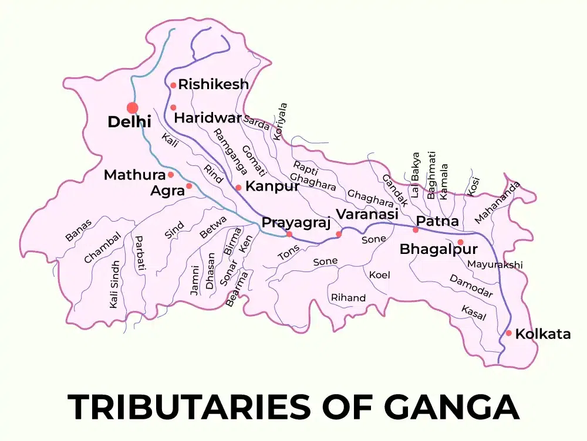

## Features & Screenshots

### Authentication

    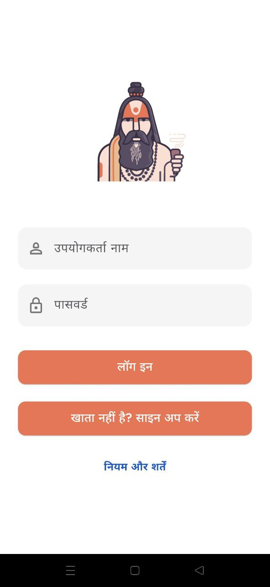
    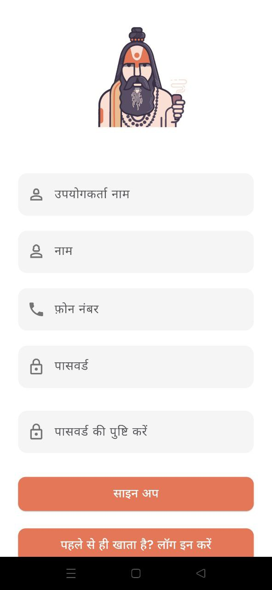
    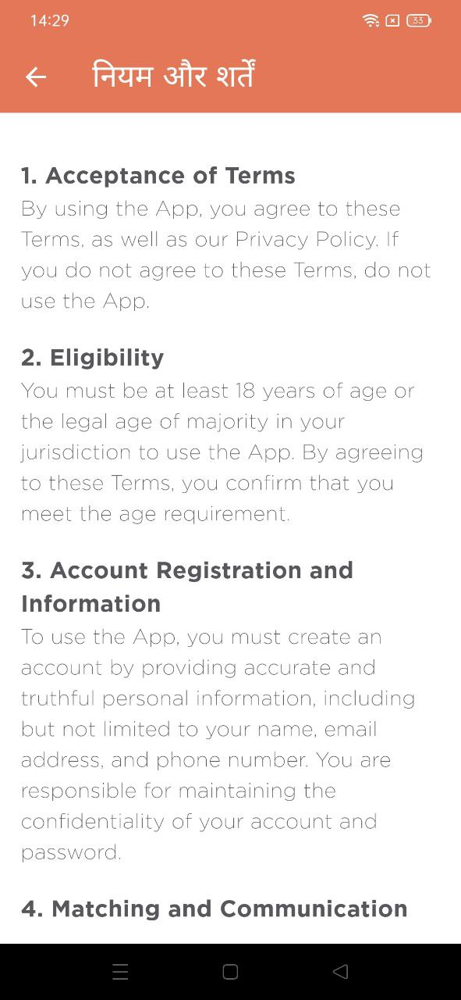

Simple and secure authentication system with username/email authentication.

### Profile Creation

    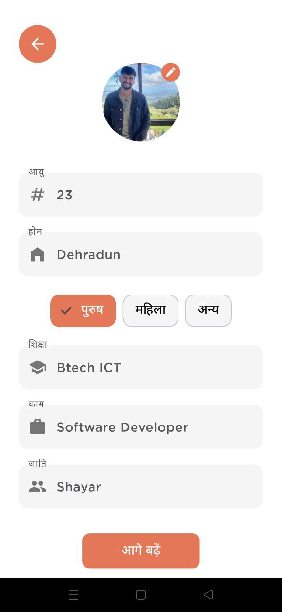
    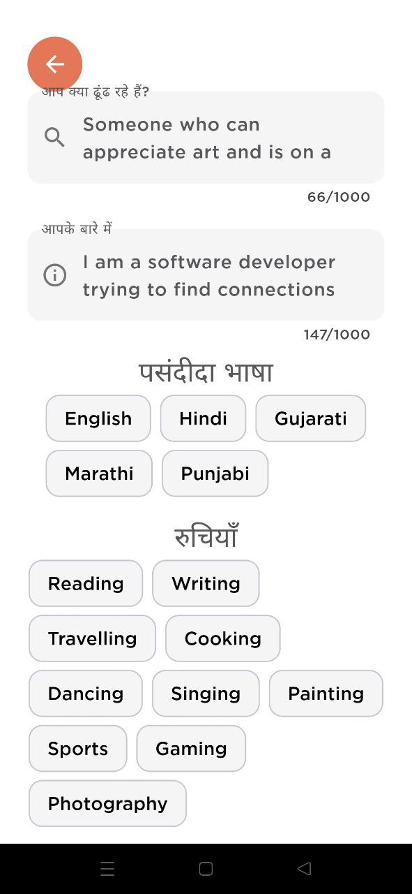
    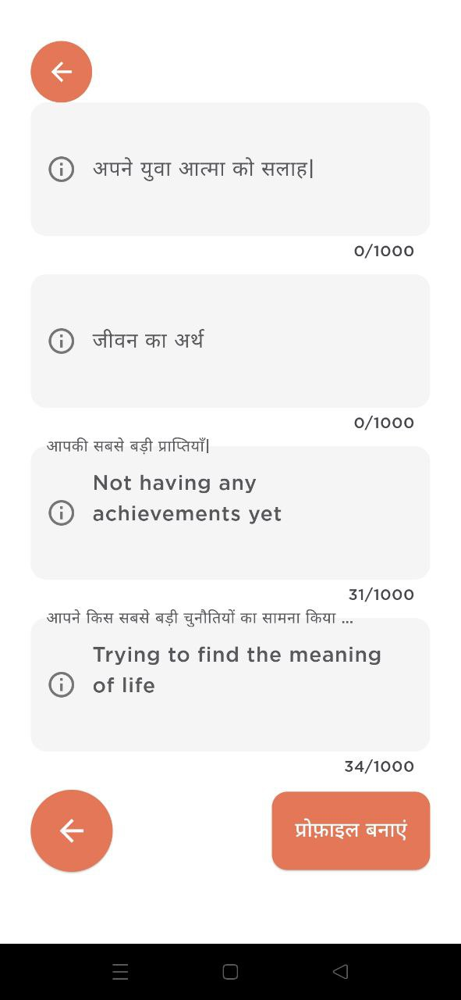

Step-by-step profile creation process helping users showcase their interests and preferences.

### Core Features

    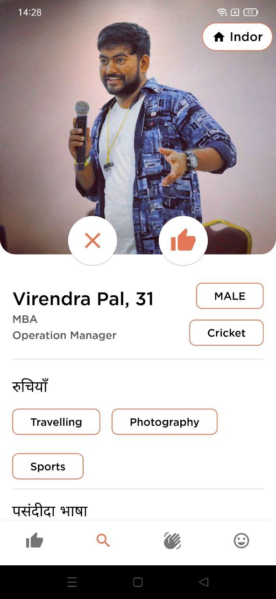
    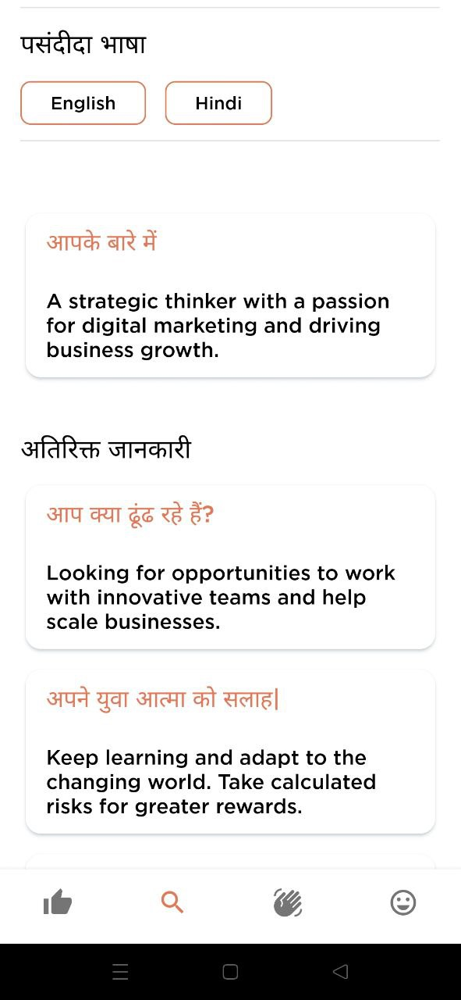
    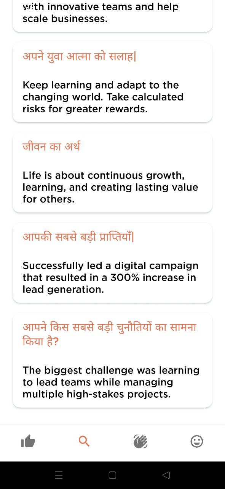

Smart matching system to help users find and connect with like-minded individuals at Kumbh.

### User Experience

    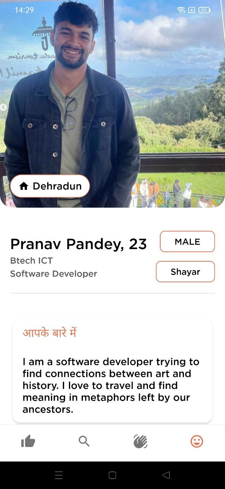
    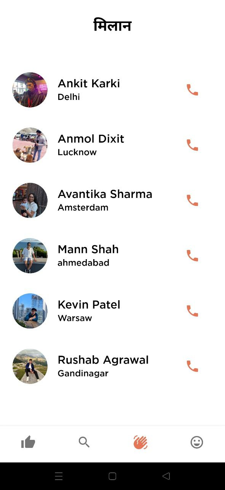
    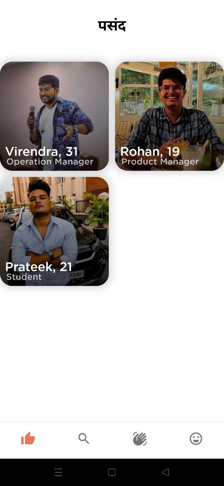
    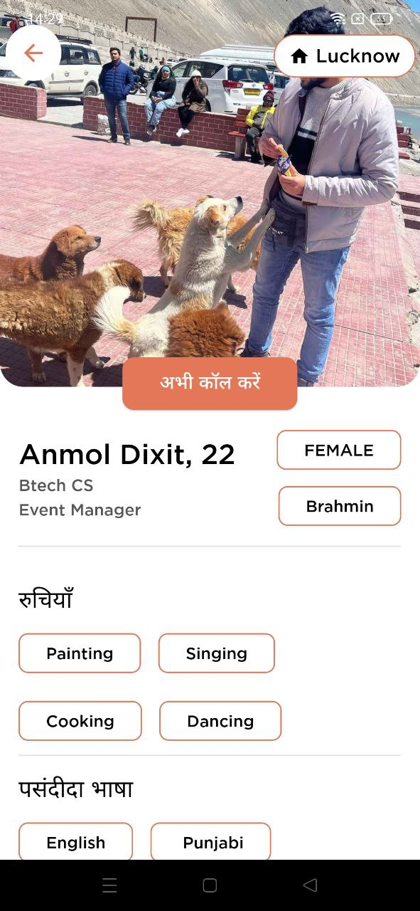

Comprehensive user interface for managing connections, viewing matches, and exploring profiles.

### Settings
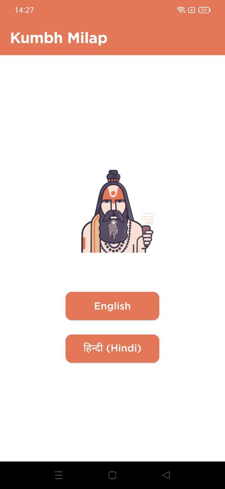
Multi-language support to accommodate users from different regions.

## Tech Stack

- **Frontend**: Flutter
- **Backend**: Python
- **Database**: MySQL
- **Containerization**: Docker

## How to run

### Server
`docker compose up`

### Mobile

` cd ./mobile
`
 
 
`flutter run`
